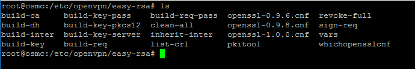

# OSMC Pi OpenVPN Server: Set up OpenVPN Server

    PreparationNote
    - OSMC IP address:192.168.1.6 
    - Router address:192.168.1.1
    - DDNS domain name: use the External IP
    - VPN server name: OSMC
    - Phone VPN client name: myphone
    - VPN client name:


**Install and Set up your keys**

Copy the files `server.conf`, `Default.txt`and `MakeOVPN.sh`and to your /home/osmc/myshare/

```bash
sudo apt-get update
sudo apt-get install -y openvpn easy-rsa
cd /etc/openvpn
sudo mkdir easy-rsa
cd easy-rsa
sudo cp -R /usr/share/easy-rsa/* /etc/openvpn/easy-rsa
ls
 ``` 
You should see the following list of files:


Edit the *vars* file so type the command:

nano /etc/openvpn/easy-rsa/vars

Edit `/etc/openvpn/easy-rsa/vars` 
```bash
export EASY_RSA="'pwd'"
# or
export EASY_RSA="/etc/openvpn/easy-rsa"

...
export KEY_SIZE=2048
...
export KEY_COUNTRY="PT"
export KEY_PROVINCE="Coimbra"
export KEY_CITY="Coimbra"
export KEY_ORG="MyHome"
export KEY_EMAIL="luis.mcp.lopes@gmail.com"
export KEY_OU="Home"
```

**Task 2: Build your certificate**

Note, in the next sequence the command *clean-all* will remove any previous keys
on your Pi.
```bash
cd /etc/openvpn/easy-rsa
sudo source ./vars
sudo ./clean-all
sudo ln -s openssl-1.0.0.cnf openssl.cnf
sudo ./build-ca
``` 
… you will be prompted for a series inputs but just hit enter to accept the default value for each. Your certificate authority has now been built.

You need to use your *VPN server osmc* from your note

`sudo ./build-key-server *osmc*`

… you will be prompted for a series inputs but just hit enter to accept the default value for each.

**Note: Common Name should default to the server name you chose (osmc), DO NOT
change it and make sure you don’t enter any text at the prompt A challenge
password … just hit the Enter key.**

Enter **y** to the following prompts:

*Sign the certificate?*

*1 out of 1 certificate requests certified, commit?*

That’s your server certificate built.

**Task 3: Generate the Diffie-Hellman key exchange**

!! Warning: this step typically takes between 30 to 60 minutes to complete !!

[Diffie-Hellman key
exchange](https://en.wikipedia.org/wiki/Diffie%E2%80%93Hellman_key_exchange) enables
the sharing of secret keys over a public server.
```bash
cd /etc/openvpn/easy-rsa
sudo ./build-dh
```
**Task 4: Set up DoS attack protection**
This step creates a key which prevents a denial of service (DoS) attack against your OpenVPN server.
```bash
cd /etc/openvpn/easy-rsa
sudo openvpn --genkey --secret keys/ta.key
```
**Task 5: Configure your OpenVPN server**
```
cp /home/osmc/myshare/server.conf /etc/openvpn/
```
Edit the `sysctl.conf` scroll down until you see the following two lines and delete the \# from the
second line so it reads:

\# Uncomment the next line to enable packet forwarding for IPv4

net.ipv4.ip_forward=1

Then type the following command ` sudo sysctl -p`

**Task 6: Set up the Pi’s firewall for OpenVPN pass through**

Type the following command; note, for the *iptables*command the IP address at the end of the command should be your Pi IP address:

`iptables -t nat -A POSTROUTING -s 10.8.0.0/24 -o eth0 -j SNAT --to-source 192.168.1.6;`

*Update: when I originally set this up I only had my Pi connected via an Ethernet cable. I later added wifi so I also ran the following command in addition to the one above:*

`iptables -t nat -A POSTROUTING -s 10.8.0.0/24 -o wlan0 -j SNAT --to-source *192.168.1.6;`

Test this has worked by typing the command:

`sudo iptables -t nat -v -L`

… and you should see your Pi IP address at the end of the second line under POSTROUTING:


Next type the command:
```bash
sudo apt-get -y install iptables-persistent
```
A wizard will then run; click **No** to each prompt and wait for the install to complete.

Then type the commands:
```bash
sudo iptables-save \> /etc/iptables/rules.v4
cat /etc/iptables/rules.v4
```
… the following should be listed:


**Task 7: Create a default config file and script to create your device keys**

```bash
sudo cp /home/osmc/myshare/Default.txt /etc/openvpn/easy-rsa/keys/
sudo cp /home/osmc/myshare/MakeOVPN.sh /etc/openvpn/easy-rsa/keys/
sudo cd /etc/openvpn/easy-rsa/keys/
sudo chmod 700 MakeOVPN.sh
```


**Test the OpenVPN**

At this stage it’s worth checking the OpenVPN server 
```bash
sudo systemctl status openvpn
sudo systemctl status openvpn\@server.service
```
… the response of each command should include the word *active* in green (if
there is no green text for *openvpn* and/or *openvpn\@server.service* then just
continue).


**Now, reboot your Pi** (type reboot) and when you have reconnected type the
following command again:
```bash
sudo systemctl status openvpn\@server.service
```
If the response indicates the service has failed …


The problem appears to be a timing issue with starting OpenVPN before your network service is fully up and running (I don’t know the exact details).

You can type the following command to restart OpenVPN (followed by the status command again to check it has started correctly):
```bash
sudo systemctl restart openvpn
sudo systemctl status openvpn\@server.service
```
… you have encountered the same problem I did (if not go to OSMC_Pi _OpenVPN_Server_Setup_device.md) or OSMC_Pi_OpenVPN_Server_Create_startup_script.md
